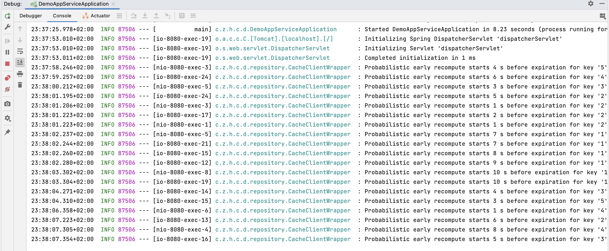
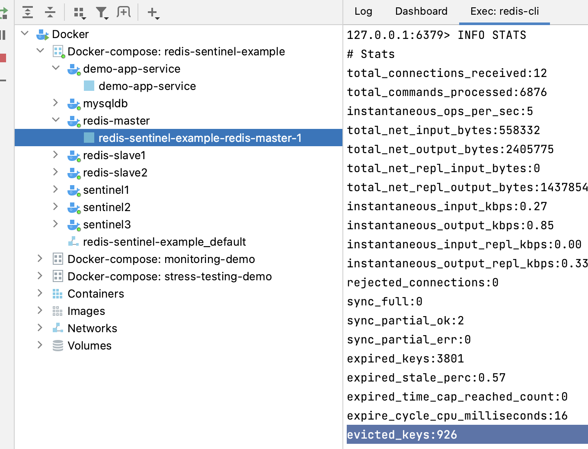
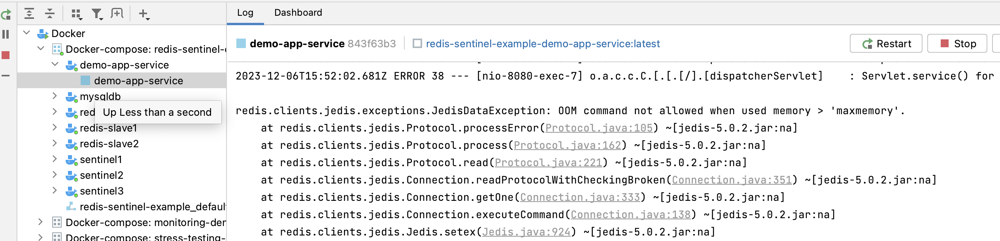

# redis-sentinel-example 
Example project to  
* run Redis Sentinel cluster 
* try Redis eviction strategies
* implement probabilistic cache wrapper


## demo-app-service

It is a Spring Boot Web application with MySQL DB and Redis Sentinel cluster for cache-aside.

DB was initiated with [import.sql](demo-app-service%2Fsrc%2Fmain%2Fresources%2Fimport.sql) script.

## Probabilistic cache client implementation

see [CacheClientWrapper.java](demo-app-service%2Fsrc%2Fmain%2Fjava%2Fcom%2Fzma%2Fhighload%2Fcourse%2Fdemoappservice%2Frepository%2FCacheClientWrapper.java)

### Command for testing:

```bash
$ siege -f siege_urls.txt -d1 -250 -t15s
```
### logs example for TTL=10s, beta=1s, delta=1s



## Redis eviction strategies tests

http://localhost:8080/products/putTestKeys?quantity=1500 - putes N quantity of test objects to Redis

### Redis INFO STATS for *allkeys-lfu* strategy



### logs for *noeviction* strategy


## Start the stack with docker compose

```bash
$ docker-compose up
```